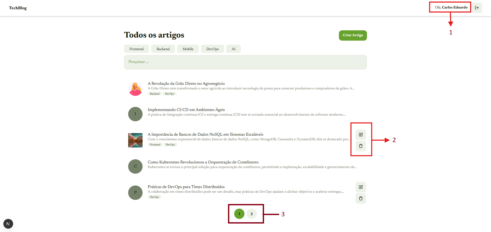
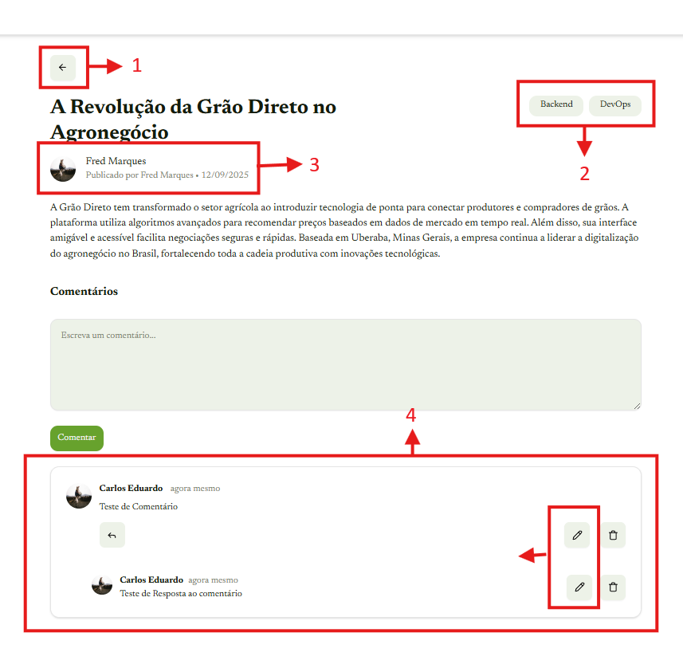
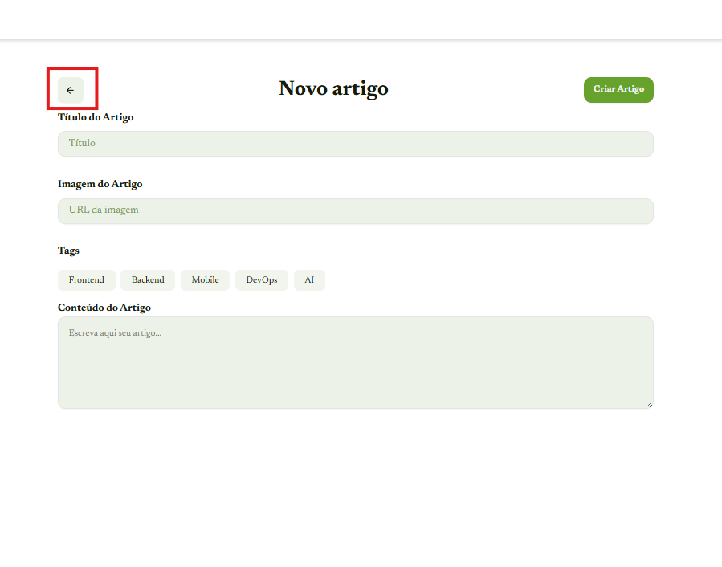
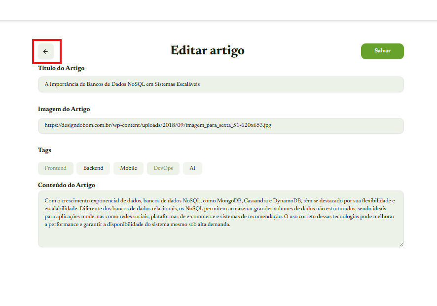
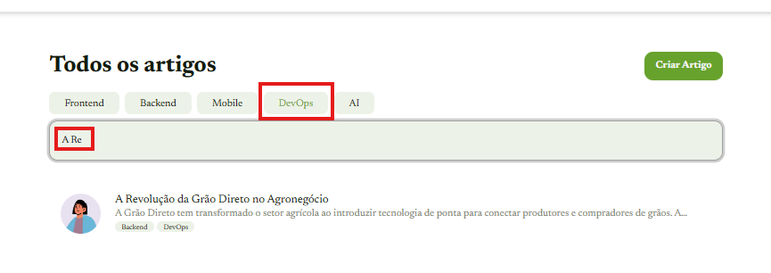

# TechBlog - Documentação do Projeto

## Visão Geral

> O TechBlog é uma aplicação web moderna desenvolvida com Next.js 15, TypeScript e SQLite, projetada para criar e gerenciar artigos técnicos. A aplicação oferece funcionalidades completas de autenticação, criação de artigos, pesquisa por tags e termos do título e conteúdo do artigo, sistema de comentários, respostas e tags, tudo integrado em uma interface responsiva e visualmente atraente.

## Decisões Técnicas

### Stack Tecnológica

- **Next.js** 15: Utilizado como framework principal para React, aproveitando os recursos mais recentes como o App Router, Server Components e Turbopack para desenvolvimento mais rápido.
- **TypeScript**: Implementado para garantir tipagem estática, melhorando a manutenibilidade e reduzindo erros em tempo de desenvolvimento.
- **SQLite**: Escolhido como banco de dados para simplicidade de configuração e desenvolvimento local, com possibilidade de migração para PostgreSQL em ambientes de produção.
- **Prisma**: Utilizado como ORM para facilitar a interação com o banco de dados e garantir tipagem segura das operações.
- **Tailwind CSS**: Framework CSS utilitário para estilização rápida e consistente, com foco em responsividade.
- **Framer Motion**: Biblioteca de animação para criar transições e efeitos visuais suaves.

### Arquitetura

#### Estrutura de Pastas

```
techblog-gd/
├── app/                 # App Router do Next.js
│   ├── api/             # Rotas da API
│   ├── components/      # Componentes da aplicação
│   ├── constants/       # Constantes e textos
│   ├── contexts/        # Contextos do React
│   └── (with-topbar)/   # Layout com barra superior
├── components/ui/       # Componentes UI reutilizáveis
├── lib/                 # Funções utilitárias e configurações
├── prisma/              # Configurações do Prisma e migrations
└── scripts/             # Scripts auxiliares
```

#### Padrões de Projeto

1. **Componentização**: Componentes reutilizáveis são separados em pastas específicas para facilitar a manutenção.
2. **Separação de Concerns**: Lógica de negócios é isolada em funções utilitárias e serviços.
3. **Autenticação**: Sistema de autenticação baseado em tokens, com senhas salvas no banco de dados em HASH seguindo uma criptografia SHA256 para segurança.
4. **Autenticação baseada em token**: Sistema de sessão utilizando tokens de sessão armazenados em cookies para acesso as rotas APIRest(POST,PUT,DELETE) com segurança.
5. **Server Components**: Aproveitamento máximo dos Server Components do Next.js para melhor performance.

### Escolhas de Implementação

#### Autenticação

> - **Tokens de Sessão**: Implementação de autenticação baseada em tokens armazenados em cookies para segurança.
> - **Validação de Sessão**: Middleware e funções utilitárias para validar tokens em rotas protegidas.
> - **Proteção CSRF**: Utilização de tokens para prevenir ataques CSRF.

#### Banco de Dados

> - **Modelagem Relacional**: Estrutura de banco de dados com relacionamentos adequados entre usuários, artigos, comentários e tags.
> - **Migrations**: Utilização do Prisma Migrate para versionamento do esquema do banco de dados.
> - **IDs Criptográficos**: Geração de IDs únicos utilizando funções criptográficas para segurança.

#### API

> - **RESTful Design**: Rotas da API seguindo princípios REST para operações CRUD.
> - **Tratamento de Erros**: Implementação consistente de tratamento de erros com mensagens claras e códigos de status apropriados.
> - **Validação de Token**: Middleware para validar tokens de autenticação em rotas protegidas.

#### Interface do Usuário

> - **Design Responsivo**: Interface totalmente responsiva utilizando Tailwind CSS.
> - **Animações**: Implementação de animações sutis com Framer Motion para melhorar a experiência do usuário.
> - **Componentes Reutilizáveis**: Criação de componentes UI reutilizáveis para manter consistência visual.

#### Melhorias de Interface e Principais Decisões de Front-End



- **Page Home(/Home)**: Nessa página que é a principal página do sistema tomei algumas decisões baseadas em fortalecer a identidade visual do sistema para o usuário e criar uma experiência visual e usual agradável para o usuário.
- **Decisão 1**: Bom para a primeira decisão que foi de exibir o nome do usuário que está logado no sistema, devido a como implementei o sistema de autenticação, o usuário possui uma sessão ativa ao se autenticar e percebi que no mockup não teria sido previsto essa informação, então decidi colocar o nome do usuário na página home para que ele possa ver seu nome e saber que ele está logado no sistema.
- **Decisão 2**: Segunda decisão tomada foi de padronizar os botões utilizando componentes reutilizáveis que criei para os Buttons `ButtonPrimary.tsx` e `ButtonSecondary.tsx` que se encontram na pasta `components/buttonsGlobal/` resolvi utilizar o `ButtonSecondary` para os botões de Editar e Deletar um artigo criado pelo usuário, tornando padronizado todo o sistema de Buttons e estilização seguindo cores da identidade Visual, acredito que a UI/UX do sistema seja mais simples e intuitiva para o usuário trazendo uma experiência visual mais agradável.
- **Decisão 3**: A terceira e última decisão tomada para a page Home, foi na paginação da listagem de artigos, onde foi também implementado o `paginationGlobal.tsx` que se encontra na pasta `components/paginationGlobal/` e pensando também na usabilidade do usuário e querendo trazer uma identidade visual fortalecida pelo sistema, decidi utilizar para as cores dos buttons de paginação as mesmas dos botões `ButtonPrimary.tsx` e `ButtonSecondary.tsx`.



* **Page Articles(/articles/:id)**: Nessa página de detalhes de um artigo, fiz quatro mudanças que creio ser pertinentes para uma usabilidade agradável para o usuário.
* **Decisão 1**: Realizei a criação de um botão intuitivo para que o usuário possa voltar para a página anterior sem precisar voltar para a homepage toda vez, ou até mesmo utilizar o botão de voltar do navegador.
* **Decisão 2**: Alinhei as Tags do artigo para ficarem alinhados com o título e sempre ao final da DIV para assim tornar uma experiência mais agradável para o usuário mostrando uma simetria.
* **Decisão 3**: Nas informações de autor do artigo, quis proporcionar ao usuário uma experiência mais rápida de forma visual do autor do artigo, adicionando um componente de `Avatar` do `Shadcn-ui` e o nome do autor também em evidência para facilitar a identificação do autor do artigo.
* **Decisão 4**: Essa foi nos comentários de um artigo, onde outras pessoas(usuários) podem interagir com o artigo através de comentários, onde foi criado bordas para destacar e separar os comentários e respostas trazendo uma experiência ao usuário de organização e clareza. E outro ponto de decisão tomado nessa parte de comentários foi criar um botão de editar tanto o comentário como a resposta pensando em um comentário grande e talvez cometido um erro simples de escrita não ter a necessidade de excluir o comentário inteiro, mas sim apenas editar o comentário ou resposta e também seguindo o padrão de identidade visual do sistema utilizei para todos os botões (Reply, Edit, Delete) utilizei o componente `ButtonSecondary` mantendo assim um consistência visual dos botões.


**Page Article-New(/articles/new)**: Aqui realizei uma única alteração do mockup que foi adicionar o botão voltar seguindo os padrões de identidade visual do sistema, assim como também utilizei o `ButtonSecondary`.


**Page Article-Edit(/articles/edit/:id)**: Aqui realizei também uma única alteração do mockup que foi adicionar o botão voltar seguindo os padrões de identidade visual do sistema, assim como utilizei o `ButtonSecondary`.

## Organização do Código

### Estrutura de Componentes

Os componentes são organizados em duas categorias principais:

1. **Componentes Específicos da Aplicação** (`app/components/`): Componentes que são específicos para funcionalidades do TechBlog.
2. **Componentes UI Reutilizáveis** (`components/ui/`): Componentes genéricos que podem ser reutilizados em diferentes partes da aplicação.

### Gerenciamento de Estado

- **Context API**: Utilização do Contexto do React para gerenciar o estado global da aplicação, especialmente para informações do usuário autenticado(AuthContext.tsx).
- **Estado Local**: Componentes mantêm seu próprio estado local para dados temporários e específicos da interface.

### Rotas da API

As rotas da API estão organizadas seguindo uma estrutura lógica:

```
/api/
├── articles/           # Operações com artigos
├── login/              # Autenticação
└── tags/               # Operações com tags
```

Cada recurso possui suas próprias rotas para operações CRUD, seguindo padrões REST.

## Regras de negócio

### Autenticação

A autenticação é realizada através de um token JWT (JSON Web Token). O token é gerado pelo servidor e enviado para o cliente após o login. O token é enviado no body da requisição para acessar recursos protegidos.

A autenticação é realizada de forma simples. Apenas o usuário e a senha são verificados. A senha é criptografada usando o algoritmo SHA-256.

Após o login é criado uma sessão para o usuário. A sessão é armazenada no banco de dados. A sessão é verificada antes de acessar recursos protegidos.

Ao realizar o logout, a sessão é destruída e o token de acesso armazenado nos cookies é deletado.

### Artigos

#### Regras Backend Artigos

**CREATE**
Para criar um artigo é necessário estar logado, Título e Conteúdo são obrigatórios sem essas informações o sistema não permitirá a criação do artigo.

**UPDATE**
Para editar um artigo é necessário estar logado, Título e Conteúdo são obrigatórios sem essas informações o sistema não exibirá a opção de edição do artigo para o usuário que não é o autor.

**DELETE**
Para deletar um artigo é necessário estar logado, o usuário deve ser o autor do artigo para que o sistema permita a exclusão e assim exiba o botão de excluir.

#### Regras Backend Comentários de Artigos

**CREATE**
Para criar um comentário é necessário estar logado e ter clicado sobre um artigo para acessar os detalhes desse artigo e assim comentar sobre ele, ou comentar sobre comentários(reply) daquele artigo.

**UPDATE**
Para atualizar um comentário feito é necessário estar logado, ser o criador do comentário ou resposta de um artigo. Caso contrário o sistema não exibira o botão de editar.

**DELETE**
Para deletar um comentário ou resposta de um comentário é necessário estar logado, ser o criador do comentário ou resposta. Caso contrário o sistema não exibirá o botão de deletar.

Caso eu seja o criador de um comentário que possua várias respostas vinculadas ao meu comentário ao excluir esse comentário todas as respostas também serão excluidas.

#### Regras Backend TAGS (Pesquisa e Criação de artigos)

**CREATE**
Ao criar um artigo estando logado, você pode escolher uma ou mais tags para o artigo.
As Tags são estáticas e não podem ser alteradas ou removidas do formulário de criação de artigos.

**UPDATE**
Ao atualizar um artigo estando logado, você pode escolher uma ou mais tags para o artigo ou até mesmo modificar as tags já existentes ou remover alguma tag.

#### Pesquisa de artigos

É possível pesquisar artigos por tags na pagina Home do sistema `/home`. Onde se é possível combinar tags com pesquisas de texto.

**Exemplo:**


A pesquisa por texto é feito um match de palavras com o título ou conteúdo do artigo automaticamente ele busca as palavras em ambos caso Título retorna, senão busca no conteúdo.

## Como executar o projeto

-**Primeiro passo** : Necessário ter o **Node.js** Instalado em sua máquina, caso não tenha pode ser feito o download do instalado pelo seguinte site :[ Node.Js](https://nodejs.org/en/download) a Instalação é padrão como dos demais sistemas, next, next, finish.

-**Segundo passo** : Após a instalação do Node.js será necessário realizar o clone do repositório e então após o clone do repositório entrar na pasta `/techblog-gd` e roda o comendo `npm install` para instalação das bibliotecas necessárias.

-**Terceiro passo** : Agora precisamos criar um arquivo .env então basta comente renomear o arquivo .env-example para .env que já possui todas as variáveis de ambiente necessárias.

-**Quarto passo** : Agora precisamos gerar o Prisma Cliente executando os seguinte comando : `npx prisma generate && npx prisma migrate dev --inicialmigrate init`.

-**Quinto passo** : Popularizar o banco de dados com os dados mockados, para isso basta no terminal do seu sistema operacional estando já na pasta do projeto rodar `npm run seed` assim o script de população do banco de dados será executado.

-**Sexto passo** : Agora basta realizar o comando que executa a aplicação após o sucesso de todas as 5 etapas anteriores, no terminal execute `npm run dev` e então a aplicação será executada, basta no seu navegador acessar a url `http://localhost:3000` e pronto !

## Considerações Finais

O TechBlog foi desenvolvido com foco em boas práticas de desenvolvimento web moderno, fortalecimento da identidade visual do sistema, priorizando segurança, performance e manutenibilidade. A arquitetura escolhida permite fácil expansão e manutenção do código, enquanto as tecnologias selecionadas garantem uma experiência de desenvolvimento eficiente e uma aplicação robusta.
